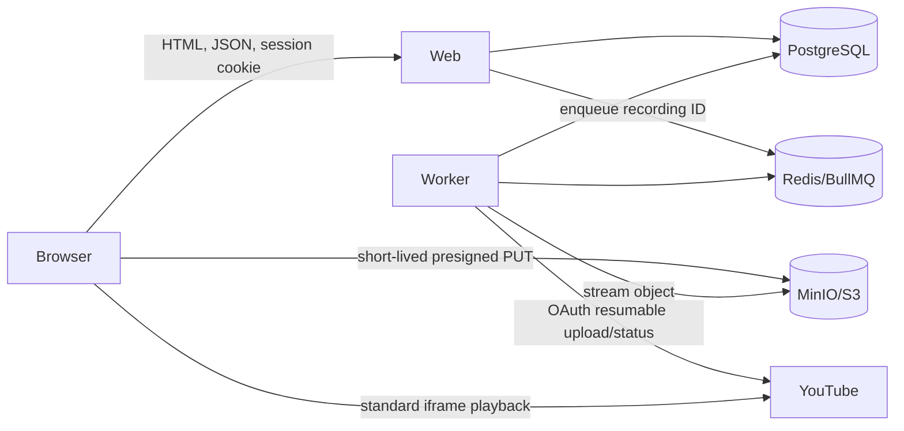

# Architecture

## Repository layout

```text
.
├── apps/
│   ├── web/                  # Next.js App Router UI and HTTP APIs
│   └── worker/               # Long-running BullMQ processors
├── packages/
│   ├── contracts/            # Shared Zod schemas, DTOs, enums, API errors
│   ├── db/                   # Drizzle schema, migrations, PostgreSQL client
│   ├── queue/                # Queue names, payloads, producer helpers
│   ├── storage/              # Private S3-compatible object operations
│   └── youtube/              # OAuth token envelope and YouTube client factory
├── plan/
├── Caddyfile
├── compose.yaml
├── package.json
└── pnpm-workspace.yaml
```

Use a plain pnpm workspace. Packages export explicit public entry points; apps never import another package's internal source path.

## Runtime services

### `web`

- Next.js App Router on Node.js.
- Renders shadcn-based UI.
- Owns Better Auth HTTP handler and custom application APIs.
- Performs authorization and database mutations.
- Creates short-lived presigned upload URLs; never buffers/proxies full recording bodies.
- Enqueues jobs only after object metadata has been verified.

### `worker`

- Separate Node.js process built from `apps/worker`.
- Runs BullMQ workers for YouTube upload, processing polling, remote deletion, and storage cleanup.
- Streams object bodies from S3-compatible storage to YouTube.
- Uses the same database, contracts, queue, and storage packages as the web app.
- Supports graceful shutdown: stop accepting jobs, let active handlers settle within the shutdown window, then close Redis/database connections.

### `postgres`

- Durable source of truth for users, content, connection metadata, and recording lifecycle.
- All timestamps stored in UTC.
- Migrations run as an explicit one-shot command, not independently from every web/worker replica.

### `redis`

- BullMQ transport, locks, delays, retry state, and rate limits.
- Not a source of truth for user-visible recording status.

### `minio`

- Private local/development object storage.
- Bucket must not allow anonymous list/get.
- Browser reaches a public/presigned endpoint; containers use an internal endpoint. Configuration must account for signature host correctness.
- Production can replace MinIO with any validated S3-compatible service without changing domain code.

### `caddy`

- Terminates HTTPS and forwards to web/MinIO endpoints.
- Required for non-localhost webcam access.
- Adds baseline security headers, including a Permissions Policy restricted to this origin for camera and microphone.

## Request and dependency flow



## Package boundaries

### `@speaking-track/contracts`

Contains only runtime-safe schemas/types/constants:

- Zod request/response schemas.
- Role and recording-state constants.
- Custom API error codes.
- Queue payload schemas.
- No database, Redis, storage, Next.js, or Node process initialization.

### `@speaking-track/db`

- Drizzle tables, relations, migrations, client factory, and transaction helpers.
- Better Auth adapter schema lives here.
- Must not import web routes or worker processors.

### `@speaking-track/queue`

- Queue names and job names.
- Typed producer helpers and deterministic job-ID functions.
- Redis connection factory with explicit lifecycle management.
- No worker business logic.

### `@speaking-track/storage`

- Private object key generation.
- Presigned PUT, stat, get stream, and delete operations.
- Provider configuration validation.
- No authorization decisions; callers supply an already-authorized recording.

### `@speaking-track/youtube`

- OAuth authorization URL/callback exchange helpers.
- AES-256-GCM token and resumable-session envelope encryption.
- Authenticated YouTube client factory and provider error classification.
- No HTTP routing, queue processors, or user authorization decisions.

## Consistency rules

- Custom API mutations validate input with shared Zod schemas before touching state.
- Ownership and role checks happen in service functions, not only in pages or route middleware.
- Client-supplied `ownerId` is ignored for user-scoped operations. Admin-scoped APIs name the target user explicitly.
- A database transaction updates recording state and creates the intent to enqueue. Task 02 chooses and implements one durable dispatch pattern; the preferred pattern is a PostgreSQL outbox drained by the worker or a dedicated dispatcher. A database state must never claim `QUEUED` if the enqueue intent can be lost between PostgreSQL and Redis.
- Queue payloads contain identifiers, not OAuth tokens, media buffers, or mutable resource snapshots.
- Job handlers lock/compare current database state before external side effects.
- YouTube video ID is written immediately after a successful `videos.insert` response and before any subsequent processing-status job is scheduled.
- Destructive domain operations must account for staged objects and remote YouTube videos; do not rely on database cascade alone.

## Deployment configuration

Required environment groups:

```text
# Application
APP_ORIGIN
NODE_ENV

# Database and queue
DATABASE_URL
REDIS_URL

# Better Auth
BETTER_AUTH_SECRET
BETTER_AUTH_URL
BOOTSTRAP_ADMIN_EMAIL
BOOTSTRAP_ADMIN_PASSWORD
BOOTSTRAP_ADMIN_NAME

# S3-compatible storage
S3_INTERNAL_ENDPOINT
S3_PUBLIC_ENDPOINT
S3_REGION
S3_BUCKET
S3_ACCESS_KEY_ID
S3_SECRET_ACCESS_KEY
S3_FORCE_PATH_STYLE
PRESIGNED_UPLOAD_TTL_SECONDS
MAX_RECORDING_BYTES
TEMP_UPLOAD_RETENTION_HOURS
MAX_STAGING_BYTES

# YouTube OAuth
GOOGLE_CLIENT_ID
GOOGLE_CLIENT_SECRET
GOOGLE_REDIRECT_URI
YOUTUBE_TOKEN_ENCRYPTION_KEY
YOUTUBE_PRIVACY_STATUS
YOUTUBE_CATEGORY_ID
YOUTUBE_NOTIFY_SUBSCRIBERS
YOUTUBE_UPLOAD_CONCURRENCY
```

Rules:

- Commit `.env.example` with names and safe descriptions only.
- Fail startup on missing/malformed required configuration for the process being started.
- `web` does not require decrypted YouTube credentials except OAuth connect/callback operations.
- `worker` never logs access tokens, refresh tokens, presigned URLs, cookies, or media metadata that contains user text.
- `YOUTUBE_PRIVACY_STATUS` is constrained to `unlisted` for the approved product contract. A temporary local override to `private` must be visibly labeled non-playable for normal users.

## Health and readiness

- Web readiness confirms process initialization and database connectivity.
- Worker readiness confirms PostgreSQL and Redis connectivity; YouTube connection may be disconnected without making the process unhealthy.
- MinIO readiness confirms the API, not only console UI.
- Compose health checks gate dependent startup where supported.
- `/api/health/live` reports process liveness.
- `/api/health/ready` reports required web dependencies without exposing credentials or detailed infrastructure internals.

## Observability

Use structured JSON logging with request/job correlation IDs. Required events:

- Authentication/admin mutations without passwords or tokens.
- Recording state transitions.
- Queue job start, retry, terminal failure, and success.
- YouTube quota/auth failures by stable error code.
- Staging cleanup and orphan detection.

Do not introduce a metrics stack in the initial implementation. Admin queue views are backed by safe aggregate counts and recent failed recording records.

## External references

- [shadcn/ui principles](https://ui.shadcn.com/docs)
- [Better Auth Next.js integration](https://better-auth.com/docs/integrations/next)
- [Better Auth admin plugin](https://better-auth.com/docs/plugins/admin)
- [MediaRecorder](https://developer.mozilla.org/en-US/docs/Web/API/MediaRecorder)
- [getUserMedia secure-context requirement](https://developer.mozilla.org/en-US/docs/Web/API/MediaDevices/getUserMedia)
- [MinIO JavaScript presigned operations](https://docs.min.io/aistor/developers/sdk/javascript/api/)
- [BullMQ retries](https://docs.bullmq.io/guide/retrying-failing-jobs)
- [YouTube resumable upload](https://developers.google.com/youtube/v3/guides/using_resumable_upload_protocol)
