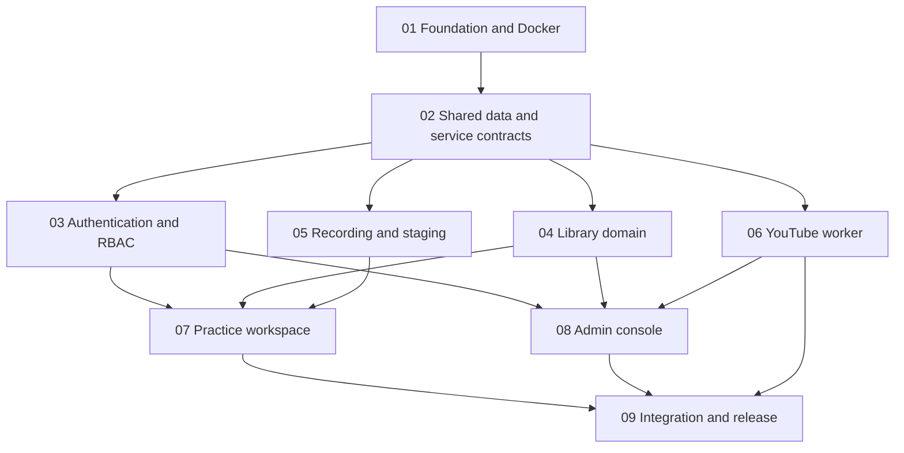

# Speaking Track implementation plan

This directory is the implementation source of truth for coding agents. The repository currently contains no application code, so agents must follow these contracts rather than inventing a second architecture.

To run the project through a coordination-only main agent, use [`ORCHESTRATOR_PROMPT.md`](./ORCHESTRATOR_PROMPT.md).

## Required reading order

Every implementation agent must read, in order:

1. [Product scope](./00-product-scope.md)
2. [Architecture](./01-architecture.md)
3. [Shared contracts](./02-shared-contracts.md)
4. [UI/UX contract](./03-ui-ux.md) when touching `apps/web`
5. Its assigned task file under [`tasks/`](./tasks/)

If a task conflicts with a shared document, the shared document wins. An agent must report a genuine contract conflict instead of silently changing shared interfaces.

## Non-negotiable decisions

- Application code is TypeScript. Infrastructure services may use their native implementations.
- Plain pnpm workspace; no Turborepo/Nx unless this plan is explicitly revised.
- Next.js web/API, a separate Node.js worker, PostgreSQL, Redis/BullMQ, and private S3-compatible staging storage.
- MinIO is the Docker/local S3-compatible implementation. Production may point the same adapter at S3, R2, or B2.
- Better Auth email/password login. Public registration is unavailable; admins create users.
- Roles are exactly `admin` and `user`. Authorization is enforced server-side on every query/mutation.
- Tags are completely user-defined. There is no hard-coded IELTS Part enum or special Part behavior.
- A topic can have many tags; a question belongs to one topic; a question has one saved draft and many recordings.
- Browser recordings stage in private object storage, then a BullMQ worker uploads them to one admin-configured YouTube channel.
- YouTube target visibility is `unlisted`, not `private`. A project not approved by YouTube may still be forced to `private`; the UI must expose that operational state rather than claiming playback is ready.
- Database recording state is the source of truth. BullMQ state is operational detail, never the user-facing authority.
- All application UI primitives come from shadcn/ui. Do not add MUI, Ant Design, Chakra, Mantine, or another component system.

## Task dependency graph

## Recommended execution waves

| Wave | Tasks | Parallelism |
|---|---|---|
| 0 | [01 Foundation and Docker](./tasks/01-foundation-docker.md) | Run alone |
| 1 | [02 Shared data and service contracts](./tasks/02-shared-data-contracts.md) | Run alone after 01 |
| 2 | [03 Auth/RBAC](./tasks/03-auth-rbac.md), [04 Library](./tasks/04-library-domain.md), [05 Recording/staging](./tasks/05-recording-staging.md), [06 YouTube worker](./tasks/06-youtube-worker.md) | Four independent agents after 02 |
| 3 | [07 Practice workspace](./tasks/07-practice-workspace.md), [08 Admin console](./tasks/08-admin-console.md) | Two independent agents after their listed dependencies |
| 4 | [09 Integration and release](./tasks/09-integration-release.md) | One integration owner after all feature tasks |

Do not start a task before all dependencies are merged. Parallel agents must stay inside their ownership boundaries. Shared-file changes require handoff to the integration owner rather than opportunistic edits.

## File ownership summary

| Task | Primary ownership |
|---|---|
| 01 | workspace manifests, base app/package scaffolds, Docker/Caddy |
| 02 | `packages/db`, `packages/contracts`, `packages/queue`, `packages/storage`; scaffold only for `packages/youtube` |
| 03 | Better Auth config, authorization helpers, `/login`, protected app shell |
| 04 | tags/topics/questions services, APIs, and `/library` pages |
| 05 | recording upload APIs and browser-to-object-storage staging client |
| 06 | `apps/worker`, `packages/youtube`, YouTube OAuth/upload APIs, queue processors |
| 07 | question practice page, draft editor, recorder controls, video history |
| 08 | `/admin` pages and admin-only application APIs not owned by task 06 |
| 09 | cross-feature fixes, end-to-end scenarios, production hardening |

## Agent working contract

Each agent must:

1. Implement the complete assigned slice; no placeholders, fake adapters, or follow-up TODOs.
2. Reuse shared schemas and helpers. Do not duplicate authorization, queue, storage, or error conventions.
3. Add only tests that protect observable behavior or a plausible regression.
4. Run focused verification for its surface, not project-wide formatting/lint/test commands while parallel work is active.
5. Report changed files, migrations, environment additions, focused verification, and any contract deviation.
6. Never include real credentials, OAuth tokens, uploaded media, or generated MinIO data in Git.

## Completion definition

The project is complete only when:

- `docker compose up` starts a healthy web app, worker, PostgreSQL, Redis, MinIO, and HTTPS proxy.
- A seeded admin can log in and create a normal user; public sign-up fails.
- Users can manage their own tags, topics, questions, and question draft without seeing another user's data.
- A user can record camera/microphone, upload to MinIO, observe queue progress, and later play the YouTube result.
- Multiple recordings can belong to one question.
- Admin can inspect and manage all users and owned application data.
- Queue retries are idempotent and never create a duplicate YouTube video for one recording.
- Temporary objects are deleted only after safe terminal processing or explicit deletion.
- Permission denial, expired OAuth, quota exhaustion, interrupted uploads, processing failure, and exhausted staging capacity produce actionable UI states.
- The actual browser surfaces are verified at desktop and 375 px mobile width.
